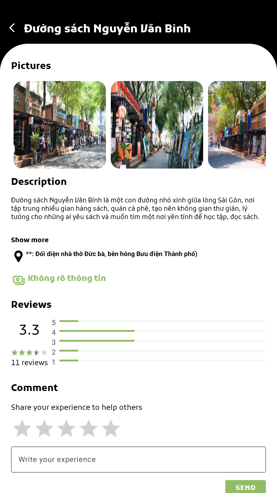

# Get Go Front-End

This project is built about the Android application of GetGo - a tourism support application which assist people for suggesting a suitable tourist route.


[![JAVA][java-shield]][java-url] [![Firebase][firebase-shield]][firebase-url]


## Table of Contents
1. [About the Project](#introduction)
2. [Getting Started](#getting-started)
3. [Contributing](#contribution)


## About The Project <a id="introduction"></a>


GetGo is an Android application designed to help users explore and get the most out of their travel experiences. With this app, users can discover new destinations, plan their trips, and share their stories with the community.


<p align="right">(<a href="#readme-top">back to top</a>)</p>


<div align="center">
  
  
  <p align="center">Demonstrating the UI of the GetGo app. The left panel showcases the home page, while the right panel displays detailed information about a location when the user taps to view more details</p>
</div>


<!-- FEATURES -->
## Features

* **Explore Destinations:** Browse and discover new travel destinations with detailed information and user reviews.
* **Trip Planning:** Plan your trips by adding destinations to your itinerary and managing your travel schedule.
* **Story Sharing:** Upload and share your travel stories with the community. View stories from other users to get inspired.
* **User Profiles:** Create and manage your user profile. View and interact with other users' profiles.
* **Social Media Integration:** Connect with your social media accounts to share your experiences and follow friends' journeys.


## Getting Started <a id="getting-started"></a>

### Prerequisites
* Android Studio

### Installation
1. Clone the repository:

    ```sh
    git clone https://github.com/GetGo-App/getgo-frontend
    ```

2. Open the project in Android Studio:
    * Launch Android Studio.
    * Select "Open an existing Android Studio project."
    * Navigate to the cloned repository and select the GetGo-Mobile folder.
  
3. Build the project:

    * Sync the project with Gradle files.
    * Build the project by selecting Build > Rebuild Project.

4. Run the app:

    * Connect your Android device or start an emulator.
    * Click the Run button or select Run > Run 'app'.


## Contributing <a id="contribution"></a>

We welcome contributions to improve GetGo-Mobile. If you would like to contribute, please follow these steps:

1. Fork the Project
2. Create your Feature Branch (`git checkout -b feature/AmazingFeature`)
3. Commit your Changes (`git commit -m 'Add some AmazingFeature'`)
4. Push to the Branch (`git push origin feature/AmazingFeature`)
5. Open a Pull Request

## Contact

Nghia Phan - promine20032@gmail.com


<p align="right">(<a href="#readme-top">back to top</a>)</p>


<!-- MARKDOWN LINKS & IMAGES -->
[contributors-shield]: https://img.shields.io/github/contributors/othneildrew/Best-README-Template.svg?style=for-the-badge
[contributors-url]: https://github.com/HieuNghia0000/GetGo-Mobile/graphs/contributors
[forks-shield]: https://img.shields.io/github/forks/othneildrew/Best-README-Template.svg?style=for-the-badge
[forks-url]: https://github.com/HieuNghia0000/GetGo-Mobile/network/members
[stars-shield]: https://img.shields.io/github/stars/othneildrew/Best-README-Template.svg?style=for-the-badge
[stars-url]: https://github.com/HieuNghia0000/GetGo-Mobile/stargazers
[issues-shield]: https://img.shields.io/github/issues/othneildrew/Best-README-Template.svg?style=for-the-badge
[issues-url]: https://github.com/HieuNghia0000/GetGo-Mobile/issues
[license-shield]: https://img.shields.io/github/license/othneildrew/Best-README-Template.svg?style=for-the-badge
[license-url]: https://github.com/HieuNghia0000/GetGo-Mobile/blob/master/LICENSE.txt

[java-shield]: https://img.shields.io/badge/Java-B8741C?style=for-the-badge&logoColor=white
[java-url]: https://www.java.com/en
[firebase-shield]: https://img.shields.io/badge/Firebase-DD2C00?style=for-the-badge&logo=firebase&logoColor=white
[firebase-url]: https://firebase.google.com
